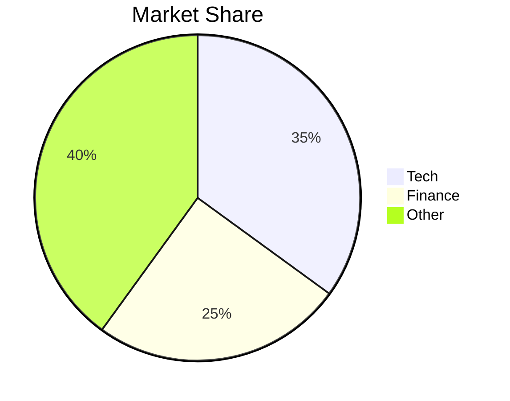

# Article Template Structure

This folder contains the template for creating new research articles for Project NIRV.

## Folder Structure

```
article-templates/
├── article-template.md    # Copy this file for each new article
├── assets/                # Place images, charts, graphs here
├── sources/               # Save PDFs, data files, research materials
└── README.md             # This file
```

## How to Use

1. **Copy this entire folder** and rename it to your article slug (e.g., `upi-infrastructure-analysis`)
2. **Rename `article-template.md`** to match your article (e.g., `upi-infrastructure.md`)
3. **Add assets** (images, charts) to the `assets/` folder
4. **Save source materials** (PDFs, datasets) in the `sources/` folder
5. **Edit the markdown** with your content
6. **Move assets to public folder**: Copy images from `assets/` to `public/static/[article-slug]/`
7. **Copy the final .md file** to `src/content/blog/[category]/` when ready to publish

## Markdown Tips

- Use `tags: ["systems"]` for technology/infrastructure analysis
- Use `tags: ["markets"]` for financial/market research  
- Use `tags: ["ideas"]` for conceptual frameworks
- Use `tags: ["notes"]` for quick observations
- Set `draft: true` to hide from production until ready
- Images should be referenced as `/static/article-slug/image.png`

## Mermaid Charts

You can create charts directly in markdown:



## Publishing Checklist

- [ ] Article written and proofread
- [ ] Images optimized and placed in `public/static/[article-slug]/`
- [ ] Sources documented
- [ ] Tags assigned correctly
- [ ] Date set correctly
- [ ] Draft status set to `false`
- [ ] File copied to `src/content/blog/[category]/`
- [ ] Test locally with `npm run dev`
