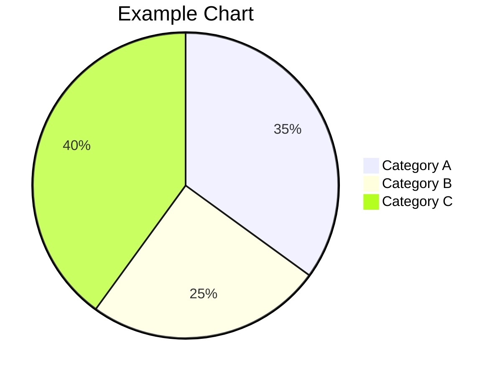

## Introduction

Brief introduction to the topic. Set the context and explain why this matters.

## Main Content

### Section 1: Key Point

Your analysis here. Use data, cite sources, explain reasoning.

### Section 2: Analysis

Continue your breakdown. Include:
- Data points
- Patterns observed
- Non-linear connections

### Section 3: Insights

What does this mean? Where is it likely headed?

## Supporting Data

Or use inline images from your assets folder:

## Conclusion

Summary of findings and directional insight.

## Sources & References

1. Source 1 - [Link](https://example.com)
2. Source 2 - [Link](https://example.com)
3. Data from verified sources

---

**Research Date**: 2025-01-01  
**Last Updated**: 2025-01-01
