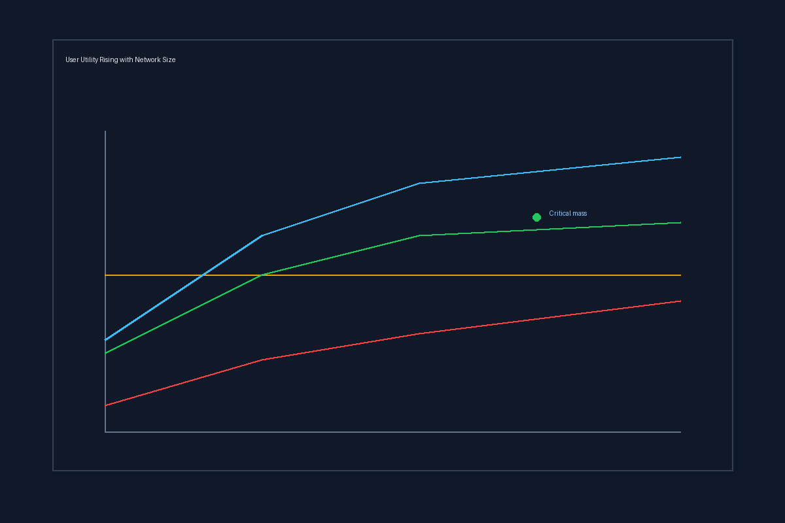
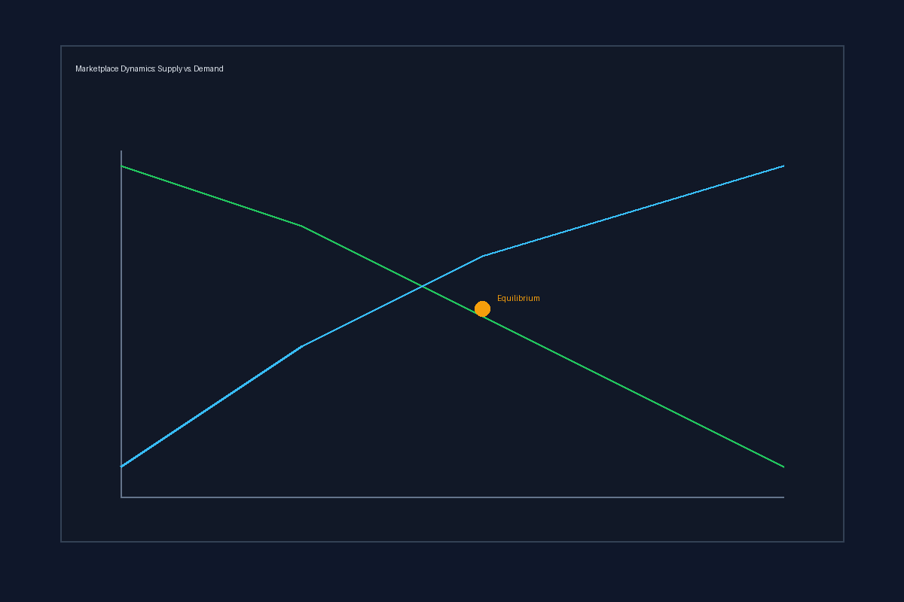
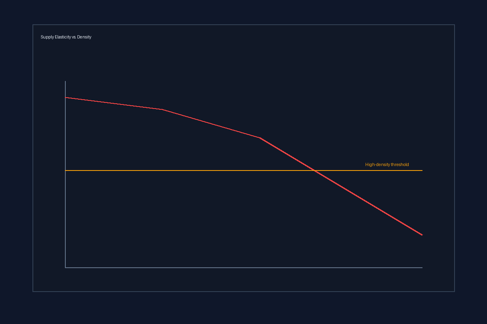

## Executive Summary

The chicken-and-egg problem in two-sided digital marketplaces is not a marketing challenge. It is a structural economic problem rooted in **indirect network effects**, **liquidity thresholds**, and **misaligned incentives**.

**Key findings:**

1. **The problem is systemic.** A two-sided marketplace becomes attractive to users on Side A only if sufficient critical mass exists on Side B—yet neither side has an incentive to join first. This creates a zero-adoption equilibrium that persists until an external actor (the platform) artificially injects demand or supply.

2. **Empirical evidence is unambiguous.** Airbnb, Uber, and DoorDash did not organically overcome the chicken-and-egg problem through traditional marketing. They purchased liquidity through:
   - **Uber:** Subsidizing 59% of rider trip costs.
   - **DoorDash:** Running negative margins on customer acquisition (CAC $6–7) with 2–3 year payback periods.
   - **Airbnb:** Leveraging highly elastic host supply once urban demand density was sufficient.

3. **Traditional go-to-market strategies fail.** Linear CAC/LTV models assume independent users. In a two-sided market, user value depends on network size, making early CAC irrational and acquisition curves non-linear.

4. **No universal solution exists.** Successful entry strategies vary from single-side launch (SaaS → marketplace) to geo-saturation to full subsidy. The optimal path depends on supply elasticity and demand density in your specific market.

5. **Open questions remain.** Decentralized protocols (e.g., ONDC) and subsidy-dependent profitability raise unresolved questions about long-term sustainability and market power.

---

## 1. System Definition: The Two-Sided Marketplace and Indirect Network Effects

### What Is a Two-Sided Marketplace?

A **two-sided digital marketplace** is a platform that creates value by enabling interactions between at least two distinct, non-overlapping user groups. Examples:

- Uber: riders ↔ drivers  
- Airbnb: guests ↔ hosts  
- DoorDash: consumers ↔ restaurants  
- B2B: buyers ↔ specialized service providers  

Unlike traditional value chains (where value is embedded in a product), marketplaces depend on **cross-side interactions**. This creates a unique economic structure: **indirect network effects**.

### Modeling Indirect Network Effects

For users on side $i$ (e.g., riders), utility increases with the number of users on the opposite side $j$ (drivers):

$$
U_i = \alpha_i + \beta_i \cdot N_j
$$

where:

- $U_i$: utility experienced by a typical user on side $i$  
- $\alpha_i$: baseline value (e.g., brand, brand trust)  
- $\beta_i$: strength of the cross-side network effect (how much each additional user on side $j$ increases utility for side $i$)  
- $N_j$: number of active users on side $j$  

Source: [web:95], [web:127]

**Key insight:** Utility is **not intrinsic** to the platform; it is **derived from the presence of the other side**. If $N_j = 0$, then $U_i = \alpha_i$ (baseline brand value only). Most two-sided marketplaces start with weak $\alpha_i$, meaning $U_i$ is tiny at cold start.

### The Chicken-and-Egg Problem Formally

A rational user on side $i$ will join if and only if:

$$
U_i > \bar{U}_i \quad \text{(adoption threshold)}
$$

In a cold-start scenario with $N_i = 0$ and $N_j = 0$:

$$
\alpha_i + \beta_i \cdot 0 < \bar{U}_i \quad \text{and} \quad \alpha_j + \beta_j \cdot 0 < \bar{U}_j
$$

**Both sides remain at zero.** The market equilibrium is a zero-participation trap, not because the platform has no value (it does, in theory), but because users have no reason to join without the other side already being present.

This is an **expectation coordination failure**. There exists a "good equilibrium" at high $N_i$ and $N_j$, but the system cannot reach it through decentralized individual choice.

Source: [web:127], [web:95], [web:96]

---

## 2. Structural Drivers of the Chicken-and-Egg Constraint

### 2.1 Liquidity Thresholds and Matching Friction

**Definition:** A marketplace achieves **liquidity** when the probability of a successful match between supply and demand is high enough that users rationally choose to participate.

Formally, a user's expected surplus from joining is:

$$
E[\text{Surplus}] = P_{\text{match}} \cdot V - C_{\text{search}} - C_{\text{friction}}
$$

where:

- $P_{\text{match}}$: probability of getting a successful match (e.g., a ride accepted within 5 minutes)  
- $V$: average value of a match to the user  
- $C_{\text{search}}$: time and cognitive effort to browse and select  
- $C_{\text{friction}}$: trust/quality risk, onboarding friction  

A rational user joins when:

$$
P_{\text{match}} \cdot V \geq C_{\text{search}} + C_{\text{friction}}
$$

Rearranging:

$$
P_{\text{match}} \geq \frac{C_{\text{search}} + C_{\text{friction}}}{V}
$$

This defines the **liquidity threshold**. Below it, expected surplus is negative and users churn.

**Empirical proxy:** In ride-hailing, a fill rate (% of ride requests fulfilled) < 85% or time-to-fill > 8 minutes in low-density areas correlates with high churn. Once fill rate exceeds 90% and time-to-fill drops to < 5 minutes, user retention jumps sharply.

Source: [web:94], [web:103], [web:125]

**Strategic implication:** The cold-start problem is a **liquidity problem**, not a branding problem. No amount of marketing changes the fact that $P_{\text{match}}$ is too low.

### 2.2 Cold-Start Trust and Quality Uncertainty (The Lemons Problem)

Early in a marketplace's life, there is no track record. Without historical reviews, completion rates, or ratings, participants face deep **information asymmetry**.

Akerlof's "lemons problem" applies: buyers assume low quality and offer low prices; sellers offering high quality exit because prices don't cover their costs. Equilibrium quality is degraded.

**Observed outcome:**

- Airbnb's early listings were sparse, had blurry photos, and priced inconsistently. Guests perceived high risk. Hosts saw low prices and low conversion. Both sides waited.  
- Uber's earliest markets showed low driver-quality (poor vehicle condition, navigation errors). Riders churn. Drivers see sporadic demand.  

**Solution:** Platforms must **subsidize quality verification** (ID checks, insurance, platform-backed guarantees) before meaningful trust exists. This is not an optional marketing expense; it is a structural prerequisite for reaching liquidity.

Source: [web:94], [web:123], [web:126]

### 2.3 Supply Elasticity and Inelasticity Traps

The speed at which supply can respond to demand incentives dramatically shapes how difficult cold start is.

**High elasticity (favorable):** Gig labor, casual hosting, marketplace sellers. Supply can enter and exit quickly in response to incentives. Fradkin et al. show that Airbnb hosts are **highly elastic**: they increase listings during peak-demand seasons (festivals, conferences) far faster than hotels can adjust capacity.

**Low elasticity (unfavorable):** Specialized B2B services, licensed professionals, real estate, or enterprise software vendors. Supply cannot scale quickly, even with high incentives.

**Implication:** In high-elasticity markets, once demand density reaches a threshold, supply floods in. In low-elasticity markets, you will perpetually struggle with supply constraints and high take rates.

Source: [web:123], [web:126], [web:128]

**Strategic insight:** Choose markets where supply is elastic, or accept that your marketplace will remain supply-constrained (and therefore high-take-rate) for the long term.

### 2.4 Multi-Sided Incentive Misalignment

In a two-sided marketplace, the platform must choose **who to subsidize** and **by how much**, subject to financing constraints and unit economics.

Evans (2003) and subsequent researchers show that optimal subsidy structures are **asymmetric**: typically, the side with higher price sensitivity and lower switching costs (demand in many cases) gets subsidized, while the supply side is charged a higher take rate.

Example:

image: "./assets/featured.png"

