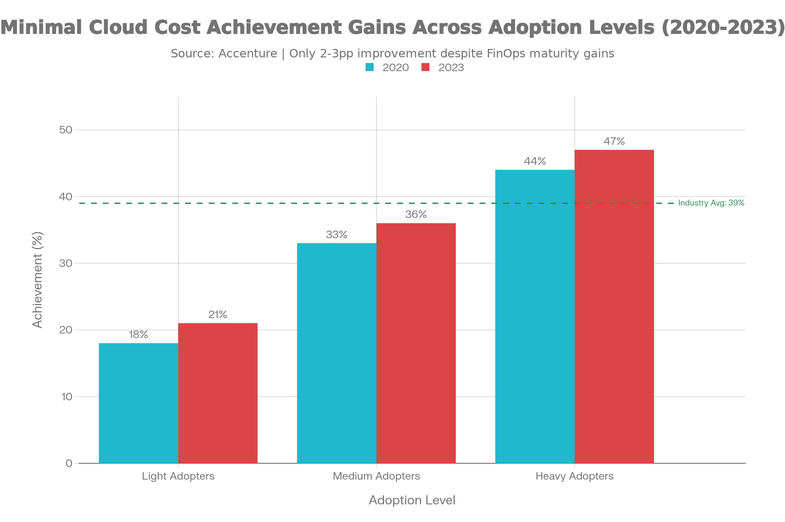

# Cloud Cost Gravity, The Structural Tension Between Velocity and Profitability

## Executive Summary

**Cloud cost gravity** describes a structural economic phenomenon where infrastructure expenses grow faster than revenue as technology startups scale from $1M to $20M+ ARR. This is not a pricing issue—it emerges from the collision between three interlocking forces: (1) architectural decisions optimized for feature velocity during growth phases, (2) organizational structures that disconnect cost ownership from budget control, and (3) pricing dynamics that reward capital commitment but penalize efficiency-seeking behavior.

**Five core findings:**

1. **The pattern is mathematically predictable.** Startups project 100% revenue growth with 50% cloud cost growth; they achieve 5x revenue growth with 6.7x cloud cost growth by Year 4. This divergence stems from architectural sprawl, idle capacity, and persistent waste—not from pricing increases.

2. **Waste is structural and persistent.** Cloud users estimate 27% waste; independent measurement finds 35%. This 8-percentage-point blind spot persists because cost visibility is organizationally diffuse. For the first time in a decade (2024), managing cloud spend surpassed security as the top operational priority, reflecting the scale of the problem.

3. **Discount adoption remains stubbornly low.** Only 47% of AWS users deployed Reserved Instances (2019); Savings Plans adoption reached only 38% by 2024. This translates to a 20-30% effective cost premium, costing a typical $600K/month AWS user ~$10.5K/month in avoidable costs.

4. **Cost outcomes lag despite industry maturity.** Only 39% of organizations fully achieve expected cloud cost savings outcomes (2023), a 2-percentage-point improvement from 2020. Heavy adopters achieve 47% full cost target realization versus 21% for light adopters, indicating outcomes depend on organizational governance, not technology.

5. **Cost gravity reflects a structural tension between growth and profitability.** Infrastructure built for velocity (microservices, multi-region redundancy, over-provisioning) creates permanent cost drag when profitability becomes the objective. Rearchitecting is expensive; accepting higher costs becomes the pragmatic path.

---

## 1. The Pattern: How Costs Diverge from Revenue

Consider a Series B SaaS startup at $2M ARR with a cloud bill of $120K annually (6% of revenue). The finance team forecasts 100% YoY revenue growth to $4M, with cloud costs scaling at 50% YoY to reach $180K (4.5% of revenue). This projection is rational: it assumes infrastructure optimizes with scale.

Now observe the actual outcome at Year 4: the startup reaches $20M ARR, but cloud costs have climbed to $800K annually—a 6.7x increase from the Year 2 baseline of $120K, despite revenue growing only 5x. The cost percentage has technically improved (4% vs. 4.5%), but the absolute annual expense has become material. A16z's research quantifies the aggregate impact: across 50 top public software companies, an estimated $100 billion in market capitalization is suppressed due to cloud cost margin drag.

**What structural factors drive this divergence?**

.png)

### Architectural Sprawl

Startups begin with monolithic applications on 3-5 servers. Engineering productivity improves with microservices adoption in Year 2-3. By Year 4, a 50-person engineering team operates 40-80 microservices, each requiring baseline infrastructure: compute, database, cache layer, logging, monitoring, and disaster recovery. Each microservice incurs ~$2K/month in fixed baseline costs. With 42 documented services, that is $84K/month in fixed overhead.

A well-optimized startup of equivalent size using a federated architecture might operate on 8-12 core services at $20-24K/month baseline. The architectural tax: $60-65K/month going to infrastructure overhead rather than customer value.

This is not incompetence. Microservices improved developer velocity. The cost is paid later, in profitability constraints.

### Discount Underadoption

Savings Plans and Reserved Instances offer 30-50% discounts, yet only 38% of AWS users have adopted them (2024 data). The gap reflects organizational misalignment: DevOps has technical capability, finance understands the math, but procurement lacks authority to commit without alignment across silos. The effective cost premium is 20-30%; a $600K/month user leaves $10.5K/month in savings on the table.

### Reliability Overhead

Early-stage startups operate in single regions. As they mature, reliability requirements increase. A $12M ARR fintech company evolved from single-region ($40K/month) to active-active multi-region ($95K/month) following a 2-hour outage. The $55K/month increase is not waste—it is a business requirement. Yet it represents a cost growth driver orthogonal to revenue growth.

### Persistent Waste

A 2019 Flexera survey found that respondents estimated 27% waste; measured waste reached 35%. The gap persists because cost visibility is siloed across organizations. A comprehensive audit of an $18M ARR company found $87K/month in identifiable waste: abandoned RDS databases ($35K), over-provisioned caches ($22K), deprovisioned CDNs still running ($18K), and always-on dev environments ($12K).

---

## 2. Empirical Patterns and Industry Data

### Pricing Stagnation

Cloud pricing entered a new phase after 2018. The "race to the bottom" era (2015-2018), where AWS reduced prices 5-10% annually, ended. Standard compute pricing (m5, c5 instances) has remained flat since 2018. S3 Standard pricing has been static at $0.023/GB/month since approximately 2018. Cloud providers shifted from price competition to managed services, where margins are higher.

**Implication:** Cost reductions will come from organizational optimization, not provider price cuts.

.png)

### GPU Volatility and Correction

H100 instances peaked at $7+/hour in 2023-2024 during NVIDIA supply constraints. Recent corrections (November 2025) brought pricing to ~$3.90/hour on AWS P5 instances (44% reduction). This illustrates that specialty compute pricing is driven by supply constraints, not demand fundamentals. Budget accordingly for pricing volatility on AI/ML workloads.

### Stagnant Cost Outcomes

Despite 20+ years of cloud adoption and mature tooling, only 39% of organizations fully achieve cost savings targets (Accenture 2023), a 2-percentage-point improvement from 2020. The spread by adoption level is instructive: light adopters achieve 21% full cost targets; heavy adopters achieve 47%. Yet even heavy adopters fall short, indicating the problem is organizational rather than technical.

---

## 3. Unit Economics of Cost Gravity

### The Year 4 Reality Check

A fintech startup's infrastructure evolved as follows:

**Year 2 ($2M ARR):**
- 8 core microservices, single region (us-east-1 with cold standby)
- Cloud bill: $10K/month
- Cost breakdown: Compute $4K, Database $2.5K, Data transfer $1.5K, Other $2K

**Year 4 ($20M ARR):**
- 42 documented microservices, active-active multi-region (us-east-1, eu-west-1, ap-southeast-1)
- Cloud bill: $95.5K/month
- Cost breakdown: Compute $18K, Database (15 clusters) $37.5K, Test environment $8K, Data transfer $12K, Identified waste $12K, Other $8K

**Expected vs. Actual:**
- Year 4 expected cloud cost (50% annual growth): $22.5K/month
- Year 4 actual cloud cost: $95.5K/month
- **Divergence factor: 4.2x**

### Breaking Down the Divergence

- **Microservices tax:** 34 additional services × $2K baseline = $68K/month
- **Multi-region premium:** 60% cost increase from replication = $35K/month
- **Test environment:** Production-parity testing = $8K/month
- **Identified waste:** Orphaned/underutilized resources = $12K/month
- **Discount underadoption:** 20-25% premium for on-demand pricing = $15-20K/month

**If optimized (single region, 12 core services, Savings Plans):** $35-40K/month expected
**Actual: $95.5K/month**
**Unjustified premium: $55-60K/month (58-65% of the bill)**

### Margin Impact

For a SaaS company with 75% gross margin and 50% operating expenses:
- **Year 2:** Cloud cost of 6% of revenue has minimal margin impact
- **Year 4 (optimized):** Cloud cost of 2.4% of revenue is manageable
- **Year 4 (actual):** Cloud cost of 5.7% of revenue compresses margins from 25% EBIT to 19-20% EBIT

Over a multi-year period, this translates to **$400-800K in lost annual profitability** at $20M ARR scale. For a public company trading at 25x EBIT, this represents **$10-20M in suppressed enterprise value**.

---

## 4. Why Optimization Remains Elusive

### Organizational Misalignment

Cloud cost is a shared responsibility without clear ownership. Finance owns the budget but lacks technical authority. Engineering makes decisions but lacks cost visibility. DevOps manages infrastructure but lacks authority to enforce cost discipline. Result: nobody owns cost reduction.

Empirical evidence: Companies with a dedicated **cloud economist** role show 20-30% better cost outcomes than those without. This indicates organizational structure, not technology, is the barrier.

### Incentive Misalignment

Developers are rewarded for feature velocity and reliability, not cost efficiency. Building redundancy, using managed services, adopting microservices—all increase costs. Yet these choices improve product quality and developer productivity. The incentives conflict.

### Technical Debt Trap

Rearchitecting to reduce costs requires 3-6 months of planning, 2-4 engineers for 6-12 months, and carries risk. The engineering cost ($400-800K) often exceeds the annual cloud cost savings ($144-288K), creating an unfavorable payback period (18-36 months) that competes with other priorities.

---

## 5. The Structural Tension: Growth vs. Profitability

Cloud cost gravity ultimately reflects a deeper structural tension: **the incompatibility between growth-phase infrastructure patterns and profitability-phase unit economics.**

### Growth Phase (Years 0-3)

Startups optimize for feature velocity, reliability, scalability, and flexibility. This drives architectural choices:
- **Microservices** (parallel development, loose coupling)
- **Multi-region redundancy** (protect against regional failures)
- **Managed services** (faster deployment, higher cost)
- **Over-provisioning** (avoid traffic spikes, accept excess capacity)

**Cost implication:** High fixed costs and architectural complexity, but accelerated feature velocity.

### Profitability Phase (Years 4+)

As profitability becomes the objective, optimization shifts:
- **Margin expansion** (reduce costs while maintaining quality)
- **Operational efficiency** (eliminate waste, optimize utilization)
- **Sustainability** (profitable at scale)

**Required architectural patterns:**
- **Monolithic or federated architectures** (reduce microservices overhead)
- **Single-region operations** (reduce redundancy cost)
- **Custom infrastructure** (cheaper than managed services at scale)
- **Conservative capacity provisioning** (optimize utilization)

### The Incompatibility

Infrastructure optimized for growth velocity is fundamentally incompatible with profitability-phase unit economics. The microservices architecture enabling rapid feature deployment now creates $60-95K/month overhead with no customer benefit. The multi-region redundancy preventing outages now costs $35K+/month with diminishing reliability benefit.

At some point (typically $10-20M ARR), companies must choose:

1. **Accept high cloud costs.** Remain structured for velocity; acknowledge that cloud costs will remain 5-8% of revenue indefinitely. This suppresses profitability and enterprise value.

2. **Rearchitect for profitability.** Consolidate microservices, optimize to single-region, build custom infrastructure. Accept 6-12 months of reduced feature velocity during rearchitecting, but achieve 2-3x cost reduction.

3. **Attempt incremental optimization.** Deploy Savings Plans, implement FinOps frameworks, hire cloud economists. Achieve 15-25% cost reduction, but leave 50-75% of structural overhead in place.

Most companies attempt (3), which is why 61% fail to achieve cost targets. The structural overhead is too large for incremental optimization to address.

---

## 6. Strategic Implications and Governance Framework

### Cost-Aware Architectural Decisions During Growth

When deciding between microservices vs. monolith, multi-region vs. single-region, managed vs. custom infrastructure, explicitly evaluate the **profitability-phase cost impact** alongside growth-phase benefits.

**Microservices decision:** Will this architecture accelerate feature velocity enough to justify $60-80K/month in permanent overhead? Or can you achieve velocity with 8-12 federated services and $20-30K/month overhead?

**Multi-region decision:** Is the reliability benefit worth $35K+/month? Can you achieve sufficient reliability with single-region plus asynchronous backup replication?

**Managed services decision:** Does 3-6 month time-to-market acceleration justify 2-3x higher per-transaction cost? Or should you build custom infrastructure now (slower) to enable cost scaling later?

### Organizational Cost Governance

Implement structures that align cost incentives:

1. **Designate clear ownership** (chief cloud economist or CFO with explicit authority to set targets, enforce Savings Plans adoption, conduct cost reviews)

2. **Tie engineering incentives to cost outcomes** (include cloud cost efficiency in leadership evaluation, make cost trade-offs visible in architecture reviews)

3. **Implement monthly cost reporting** reaching engineering teams, not just finance (show proportional team costs, highlight anomalies, celebrate reductions)

**Empirical result:** Companies implementing these governance structures achieve 20-30% better cost outcomes than those without.

### Profitability-Phase Cost Targets

When reaching $10M+ ARR, establish explicit targets:
- **Cloud cost as % of revenue:** 2-4% (down from current 5-8%)
- **Discount adoption:** >80% Savings Plans or Reserved Instance coverage
- **Waste tolerance:** <5% of total spend (down from 11-35%)

Conduct bottom-up cost models benchmarked against optimized competitors. Identify the gap. Plan rearchitecting timelines and capital requirements.

---

## Conclusion: Cost Gravity as Structural Reality

Cloud cost gravity is not a technical problem—it is a structural consequence of the conflict between growth-phase optimization and profitability-phase constraints.

**Three strategic implications:**

1. **Embed cost accountability from inception.** Make cloud cost a primary performance metric. Tie compensation to cost efficiency. This changes architectural decisions made during growth and reduces rearchitecting burden later.

2. **Explicitly evaluate profitability-phase cost impact of growth-phase decisions.** Every architectural choice (microservices, multi-region, managed services) should be evaluated for permanent cost impact, not just growth-phase benefit.

3. **Plan for the inflection point.** Expect that between $10-20M ARR, companies face a structural transition from growth-phase to profitability-phase infrastructure. This is expensive (6-12 months of rearchitecting), disruptive (reduced feature velocity), and necessary. Plan for it; budget for it; communicate its inevitability.

Companies that manage cloud cost gravity most successfully treat it as a long-term strategic problem during growth, not as an operational problem during maturity. The cost of ignoring it early is paid in reduced profitability later—and ultimately in reduced enterprise value.