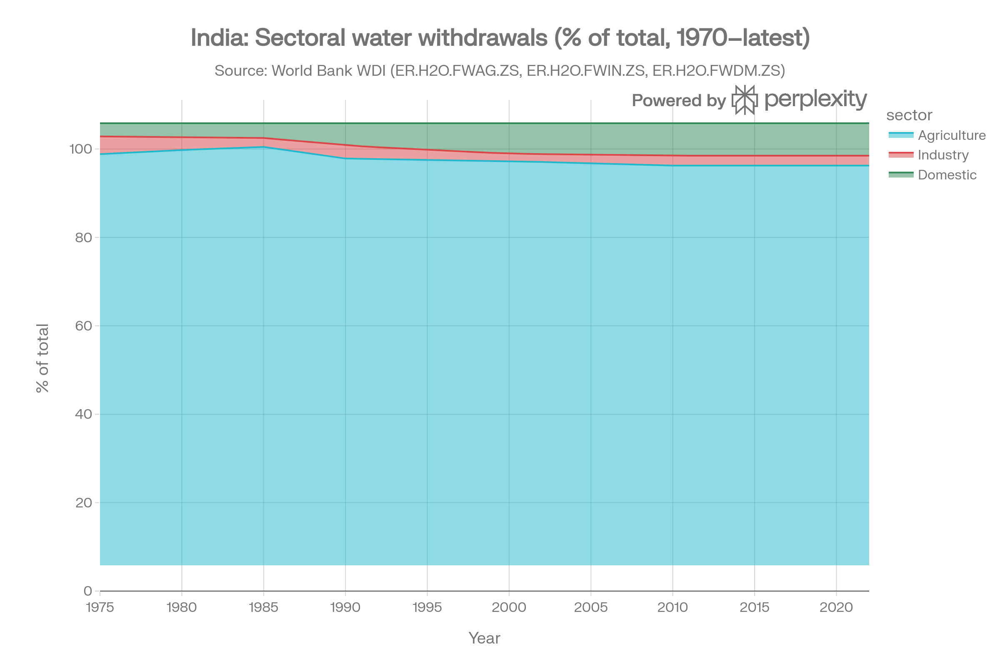
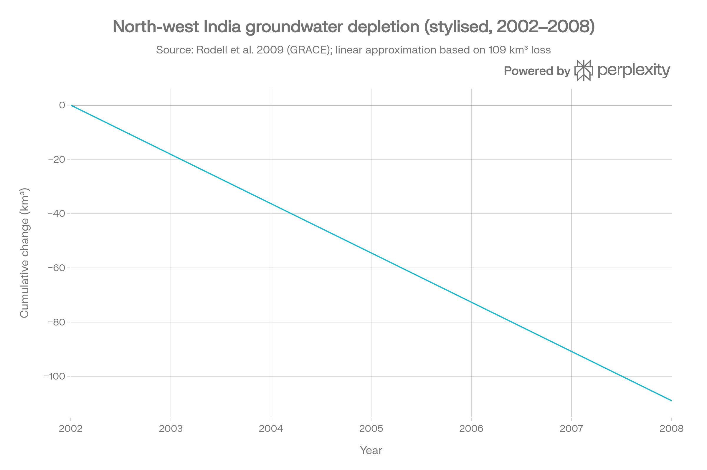
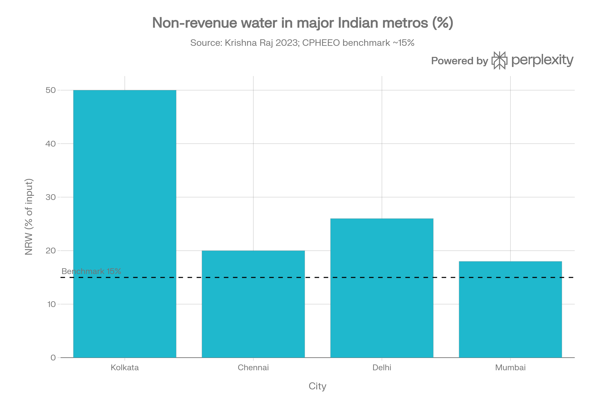
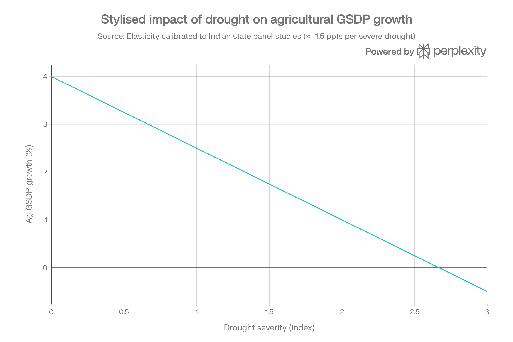

# Water and Economic Development: The Hidden Constraint Behind Growth

## Executive Summary

Water is not a seasonal headline issue; it is a structural input into India's growth model, with measurable impacts on productivity, urbanisation, and macro volatility. Four patterns stand out.

First, **agriculture is extremely water intensive**. Around 80–90% of India's water withdrawals are used for irrigation, compared to roughly one‑third in many OECD economies, locking growth into a highly water‑dependent structure. Second, **groundwater dependence and depletion are rising**. GRACE satellite data show groundwater loss of about 109 km³ in north‑west India between 2002 and 2008 (~18 km³ per year), driven primarily by irrigation in Punjab, Haryana, Rajasthan, and Delhi.

Third, **urban and industrial systems suffer high technical losses**. In Bengaluru, unaccounted‑for water reaches ~509 MLD, with major metros such as Kolkata, Delhi, Mumbai, and Chennai reporting 18–50% non‑revenue water (NRW) versus design targets of ~15%. Fourth, **drought is a persistent drag on state‑level growth**. Panel studies across Indian states find drought years reduce agricultural GSDP growth by about 1.5 percentage points on average, with weaker but visible effects on overall GSDP and human development indicators.

These are recurring constraints that can be expressed in simple ratios and elasticities, then embedded into growth and investment decisions.

<!-- GRAPH 1 PLACEHOLDER: Sectoral water withdrawals over time (India vs OECD average) -->

---

## 1. Water Intensity as a Structural Parameter

A useful summary metric is water intensity of GDP:

$$\text{Water intensity} = \frac{\text{Total freshwater withdrawals (m}^3\text{)}}{\text{Real GDP (USD)}}$$

India's sectoral pattern is skewed: agriculture accounts for the dominant share of withdrawals despite contributing a shrinking share of GDP, while industry and households share a relatively small remainder. This makes aggregate water intensity highly sensitive to irrigation practices, not to industrial efficiency gains.

In many high‑income economies, agriculture's share of total water withdrawals is closer to 30–40%, with services dominating GDP and carrying low direct water use. India's delayed structural transformation means that each marginal unit of agricultural growth still carries a large water footprint, and the system's overall water intensity declines only slowly unless irrigation efficiency improves.

---

## 2. Irrigation, Groundwater, and Depletion

At the farm level, a simple ratio captures dependence on groundwater:

$$\text{Groundwater dependence} = \frac{\text{Area irrigated by groundwater}}{\text{Total irrigated area}}$$

CGWB assessments and related syntheses show that in states like Punjab and Haryana, this ratio exceeds 0.8, with groundwater development levels above 100% (over-exploited or critical categories). GRACE-based estimates indicate that north-west India lost roughly 109 km³ of groundwater between 2002 and 2008, equivalent to a mean annual decline in water-table levels of about 0.33 metres per year in many locations.

Peer‑reviewed studies attribute around 95% of withdrawals in this region to irrigated crops such as rice and wheat, making depletion fundamentally an irrigation systems problem, not a domestic or industrial one. A later study estimates that Punjab and Haryana together depleted about 64.6 billion cubic metres of groundwater between 2003 and 2020, underlining that depletion has continued beyond the GRACE study window. The same volumes that stabilise cereal output in poor monsoon years are eroding the stock that future irrigation depends on.

<!-- GRAPH 2 PLACEHOLDER: Groundwater depletion trend in Punjab–Haryana (GRACE + CGWB) -->

---

## 3. Urban Water Supply, NRW, and Industrial Use

Urban systems can be expressed through two operational equations:

$$\text{Per capita supply} = \frac{\text{Total distributed volume (L/day)}}{\text{Served population}}$$

$$\text{NRW fraction} = \frac{\text{System input} - \text{Billed volume}}{\text{System input}}$$

Indian design norms typically assume 135–150 litres per capita per day (lpcd) for fully sewered cities, with a planning target of roughly 15% NRW in well-managed systems. 

Empirical work in Bengaluru finds that actual supply to many consumers is closer to 75 lpcd, with unaccounted‑for water of ~509 MLD and NRW/UFW levels around 20–50% across major metros (Kolkata ~50%, Chennai ~20%, Delhi ~26%, Mumbai ~18%). City‑level water balance studies for Chennai, Bengaluru, Coimbatore, and Delhi show that available raw‑water sources are often sufficient on paper, but high losses, limited treatment, and distribution bottlenecks create chronic rationing and tanker dependence.

For industry, this means incremental capacity expansions in water‑intensive sectors (e.g., power, steel, textiles, some manufacturing) increasingly compete with municipal allocations instead of drawing on genuinely additional sources. Industrial users face both volumetric constraints and reliability risk when cities run continuous deficit positions.

<!-- GRAPH 3 PLACEHOLDER: NRW (%) and lpcd delivered for major Indian metros -->

---

## 4. Wastewater, Reuse, and Effective Availability

In water-scarce basins, effective availability is better expressed as:

$$\text{Effective supply} = \text{Raw supply} - \text{Losses} + \text{Treated wastewater reused}$$

CPCB sewage inventories indicate that a large fraction of urban sewage generated is not treated, and an even smaller share is reused, implying that most cities discard a potentially significant secondary resource. 

Where treatment capacity exists, industrial parks and peri‑urban agriculture can substitute treated wastewater for freshwater withdrawals, but uptake is still limited relative to potential volumes. The gap between normative urban supply (135–150 lpcd) and actual delivery (~75 lpcd in parts of Bengaluru and similar shortfalls in Chennai and other cities) is therefore a combination of raw‑water constraints, leakages, and under‑exploited reuse options rather than a single "shortage".

---

## 5. Drought, Output Volatility, and Rural Distress

At macro level, drought can be treated as a shock to agricultural value added:

$$\Delta \text{Ag GSDP} \approx \beta \cdot \text{Drought index} + \varepsilon$$

State-level panel analyses for India find that severe drought years reduce agricultural GSDP growth by about 1.5 percentage points on average, with larger impacts in less-irrigated states and smaller but still negative spillovers on non-farm GSDP and human development indicators. Economic Survey chapters on agriculture echo this pattern, associating poor monsoon years with sharper slowdowns in overall GDP growth and spikes in food inflation.

Micro‑level evidence from Marathwada links drought and lack of irrigation directly to farmer distress. One study reports that ~87% of suicide cases experienced crop failure due to drought and irrigation shortages, and most had small, non‑viable holdings and high debt burdens. Another finds that over four‑fifths of farmer suicides in Maharashtra between the mid‑1990s and late 2010s occurred in Vidarbha and Marathwada, both chronically water‑stressed regions.

<!-- GRAPH 4 PLACEHOLDER: Drought index vs agricultural GSDP growth (panel of states) -->

---

## 6. Implication: Water as a Quantifiable Constraint

Taken together, these metrics describe a system in which growth, especially in agriculture‑dependent states and water‑stressed urban clusters, is constrained not only by capital and labour, but by volumetric and efficiency limits on water. Relevant levers are quantifiable: water intensity of GDP, groundwater dependence in irrigation, NRW fractions in cities, sewage treatment and reuse rates, and the elasticity of agricultural output to drought shocks.

For practitioners, the move from narrative to numbers is straightforward. Water risk enters investment and policy decisions via a small set of trackable ratios and state‑level parameters. Incorporating these into project appraisal, state growth strategies, and macro‑risk assessments turns “water scarcity” from a seasonal story into a structural parameter in India’s development model.
