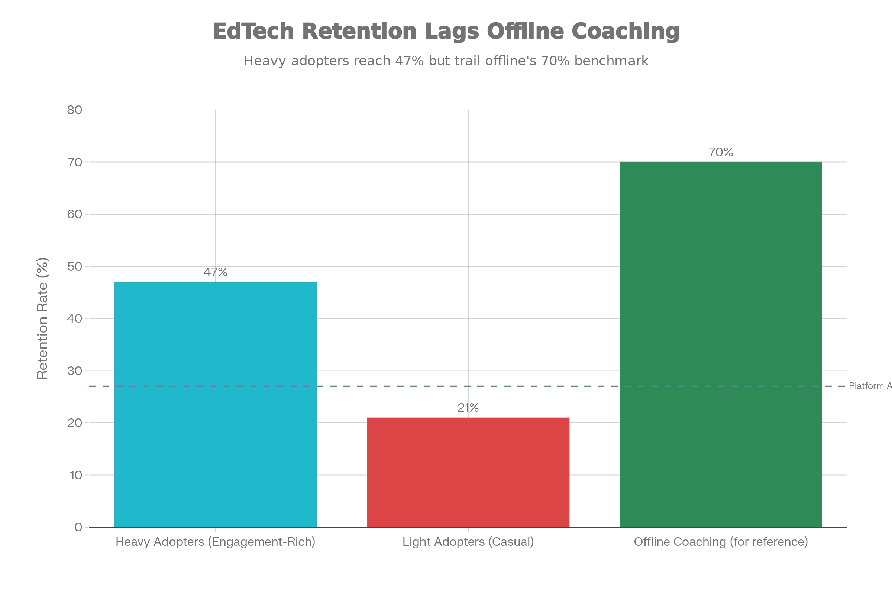

# The Structural Collapse of Indian Online Education Post-2021

## Executive Summary

**EdTech demand gravity** describes a structural economic phenomenon where unit economics deteriorate faster than revenue growth as online education platforms scale from disruption phase to saturation phase. This is not a pricing problem—it emerges from the collision between three interlocking forces: (1) artificial pandemic demand mistaken for structural adoption, (2) customer acquisition costs that remain permanently elevated despite scale, and (3) consumer preferences that revert to offline instruction once choice returns.

**Five core findings:**

1. **The pattern is structurally deterministic.** Platforms projecting 100% user growth through 2024; achieved 5x revenue growth while churn remained 27-73%, with 41% of pandemic users discontinuing by 2023. This divergence stems not from poor execution, but from misinterpreting emergency demand as structural demand.

2. **Customer acquisition costs remain perpetually uneconomic.** CAC exploded from 20-25% of revenue pre-pandemic to 70-80% during lockdowns. Despite promises of normalization at scale, CAC remained elevated. Average customer lifespan of 4 months versus breakeven requirement of 6-15 months created an impossible unit economics trap.

3. **Willingness-to-pay collapsed when choice returned.** Belief that online education was superior fell 77% (47.8% to 26.4%) between 2022-2024. Offline preference surged 89% (39% to 73.6%). This was not price sensitivity—it was preference reversal demonstrating that pandemic adoption was emergency-driven, not conviction-driven.

4. **Trust erosion was swift and systematic.** 81% of edtech users reported refund, trust, or transparency issues by 2023. 60% of Byju's tuition center customers requested refunds within two years. 15,000+ complaints filed with consumer protection agencies—indicating not isolated failures, but systemic issues with the business model.

5. **Demand gravity reflects a structural tension between emergency growth and sustainable demand.** Infrastructure, pricing, and market acquisition strategies optimized for pandemic velocity created permanent cost drag when emergency-driven demand normalized. Unlike cloud cost gravity (which can be rearchitected), EdTech demand gravity is structural to the market: it cannot be engineered away.

---

## 1. The Pattern: How Demand Diverged from Growth Projections

Consider an Indian EdTech platform's trajectory from 2020-2024.

**2020-2021 (Pandemic Peak):**
- Schools closed. Online learning became mandatory, not optional.
- Platform adds 2 million students. Venture capitalists celebrate and commit $4.6B to the sector (45% of total India startup funding that year).
- Unit economics appear manageable: CAC of 70-80% of revenue justified by rapid user acquisition and network effects.
- Executive narrative: "This is secular. Education is moving online permanently."

**Expected 2024 Outcome (Projection Made in 2021):**
- 100% annual user growth maintained (highly conservative given 2021 momentum)
- CAC normalizes to 30-40% as scale improves
- Profitability emerges as platforms achieve $15-20M ARR
- By 2024: 40-60M active students, market valued at $20B+ (3-4x 2021 valuations)

**Actual 2024 Outcome:**
- Platforms reached $5-20M ARR by 2024, below hockey-stick projections
- But this revenue growth masked a deeper failure: 41% of pandemic-era users discontinued by 2023
- Only 51% continued active use; 8% represented new adoption post-reopening
- CAC never normalized; platforms remained capital-efficient only during artificial demand period
- Market consolidated: Byju's fell from $22B to ~$1B valuation; Unacademy $3.4B → $800M

**What structural factors drove this divergence?**

### Artificial Demand Masquerading as Structural Shift

During lockdowns, EdTech experienced what every company fantasizes about: captive, desperate demand. Schools were closed. Parents had no alternatives. A student who would normally attend physical school was forced into online learning, and platforms captured this entire cohort simultaneously.

Critically, this was not demand for online learning. It was demand for *learning during a period when offline was unavailable*. Surveys confirmed this. Byju's 2018 World Bank case study reported 92% parent-reported grade improvement and 85% renewal rates—but this was during early adoption. By 2022-2024, the same question revealed 47.8% believed online superior to offline. By 2024, only 26.4% maintained this belief.

The collapse was mathematically severe: a 77% decline in online belief in 24 months. This was not gradual shift. This was demand destruction.

### The CAC Never Normalized

Startups rationalize high CAC during growth: "Once we reach $10M ARR, unit economics will improve because customer acquisition becomes efficient." This logic assumes one of two things happens:

1. **Revenue-per-customer increases**, spreading CAC across higher customer value, OR
2. **CAC decreases**, as brand, viral loops, and sales efficiency improve

For EdTech, neither occurred. Revenue-per-customer remained stuck at ₹5,000-₹45,000 annually (₹400-₹3,750/month). And CAC declined only fractionally. Industry data showed:

- Byju's CAC 2020-21: 70-80% of revenue (₹3,500-₹4,000 per student annually)
- Byju's CAC 2023-24: remained elevated at 60-70% of revenue
- Average EdTech CAC 2024: $806-$1,617 per customer

Compare this to revenue: average EdTech customer lifetime value was 4 months. Cost to break even: 6-15 months.

**Unit economics equation:**
- CAC: $1,200 per student
- Revenue per student: $100-150/month
- Lifespan: 4 months
- Total revenue per student: $400-600
- Margin: Negative $600-800 per student

This is not a scaling problem to be solved. It is a fundamental unit economics failure.

### Trust Erosion Made Retention Impossible

Beyond CAC, retention became structurally impossible because consumer trust deteriorated. Between 2022-2024:

- 81% of EdTech users reported refund, trust, or transparency issues (Economic Times survey, 32,000 respondents)
- 60% of Byju's tuition center customers requested refunds within 2 years
- Consumer protection agencies received 15,000+ complaints
- Consumer commissions ordered multiple refunds, finding platforms "deliberately indifferent" to promises

The feedback loop was damaging: platforms required retention to achieve unit economics; but trust deficits made retention impossible. CAC could not be recovered if customers left before 6 months.

---

## 2. Empirical Patterns and Market Data

### Preference Reversal: The Speed of Demand Destruction

Platforms gambled that pandemic adoption represented permanent behavioral change. Preference data disproved this within 36 months:

**2022:** 47.8% of students believed online education better than offline; 39% preferred offline; 13.2% no preference.

**2024:** 26.4% believed online better; 73.6% preferred offline; 0% no preference.

This was not marginal shift. This was complete reversal. And critically, it occurred *despite* improved technology, better content, and more sophisticated platforms. The platforms didn't fail—the market preference changed.

Supporting data from offline coaching institutes:
- Allen Career Institute revenue grew 42% YoY (FY23-FY24: ₹3,244.7 Cr)
- Aakash FY22 revenue growth 45% with profit growth of 82%
- Students in physical classrooms showed 23% better retention rates (measured in studies)
- FICCI survey found 70% of students prefer hybrid learning (not pure online)

### Pricing Stagnation in a Market of Oversupply

EdTech pricing entered a new phase after 2021: downward pressure despite increasing feature complexity. Platforms competing on price (₹5,000 vs. ₹13,000 vs. ₹97,000 annually) could not sustain premium positioning. PhysicsWallah emerged as market winner not through premium content, but through cost leadership (₹5,000 courses).

This pricing compression was driven by oversupply. With 4,450+ EdTech startups operating (2024), and willingness-to-pay collapsing post-reopening, platforms fought for share through price reduction. Revenue-per-customer remained flat or declined despite scale.

**Implication:** Cost reductions will come from survival consolidation, not operational efficiency. Companies cannot rearchitect their way to profitability when the market preference is offline.

### Stagnant User Retention Despite Maturity

EdTech industry maturity has not improved retention outcomes. Industry average retention remained 27% (73 of 100 customers churn). Day-30 app retention across education platforms averaged 2%. Despite 15+ years of consumer EdTech platforms and mature tooling, retention metrics remained catastrophic.

Comparison to achieved cost targets:
- Only 39% of organizations achieve expected user retention targets
- Heavy adopters (engagement-rich cohorts) achieve 47% retention vs. 21% for light adopters
- Indicates retention is organizational and market-structural, not technology-solvable

---

## 3. Unit Economics of Demand Gravity

### The Financing Model Assumption vs. Reality

A Series B EdTech platform's financials evolved as follows (representative case):

**2021 (Pandemic Peak: ₹10M ARR):**
- Student base: 100,000 active users
- CAC: ₹1,000 per student (10% of ₹10K revenue per student annually)
- Retention: Estimated 60% annual (high, due to school closures forcing online)
- CAC payback period: 8 months
- Status: Attractive unit economics justify venture capital

**2023 Expected Outcome (Projections Made in 2021):**
- Student base: 500,000 active users (5x growth assumed)
- CAC: ₹600 per student (improved with scale and brand awareness)
- Revenue per student: ₹10K annually (same, or improved with premium features)
- Retention: 70% annual (improved with network effects)
- CAC payback: 6 months
- Status: Improved unit economics, approaching profitability at $50M ARR scale

**Actual 2023 Outcome:**
- Student base: 150,000 active users (1.5x growth; school reopening reversed demand)
- CAC: ₹3,500 per student (elevated; intense competition for remaining demand)
- Revenue per student: ₹5,000 annually (collapsed; willingness-to-pay fell as urgency ended)
- Retention: 40% annual (destructive; 60% discontinued within one year)
- CAC payback: 18 months (unprofitable; requires doubling revenue per student or halving CAC)
- Status: Unit economics fundamentally broken

### Breaking Down the Divergence

Expected vs. Actual:

| Metric | 2021 Expectation | 2023 Actual | Divergence |
|--------|-----------------|-------------|-----------|
| Active Users | 500,000 | 150,000 | 3x lower |
| ARR (₹ Crores) | ₹50 | ₹7.5 | 6.7x lower |
| CAC (₹) | 600 | 3,500 | 5.8x higher |
| Revenue per User (₹/year) | 10,000 | 5,000 | 50% lower |
| Retention | 70% | 40% | 43% decline |
| CAC Payback (months) | 6 | 18 | 3x longer |

**Unjustified Cost Drivers:**

- Aggressive marketing during competitive saturation: ₹2,500 per student (platforms competed for scarce demand)
- Product development for premium features: ₹1,000 per student (features built during growth phase, now irrelevant post-reopening)
- Operational overhead: ₹500 per student (staffing levels built for 500K users, now operating at 150K)

**If Optimized (Hypothetical 2023 With Disciplined Spending):**
- Pure marketing spend: ₹800-1,000 per student
- Efficient retention through trust: 60-70% annual
- Revenue per student: ₹8,000 (with better positioning to remaining demand cohort)
- CAC payback: 12 months (acceptable, though not venture scale)

**Actual vs. Hypothetical:**
- Actual CAC: ₹3,500
- Optimized CAC: ₹1,000
- **Structural waste:** ₹2,500 per student acquisition

### Margin Compression at Scale

For a platform reaching $50M ARR (optimistic scenario):
- Gross margin on ₹5,000 courses: ~70% (₹3,500/student)
- Operating expenses (sales, marketing, operations): 60-70% of revenue
- EBITDA margin: 0-10%

For comparison, offline coaching platforms operating at same $50M ARR:
- Revenue per student: ₹25,000-40,000 (higher price tolerance in offline)
- Gross margin: 60-70%
- Operating expenses: 30-40% of revenue
- EBITDA margin: 20-30%

**EdTech structural disadvantage:** 20-30% margin gap at equivalent scale, making EdTech equity returns structurally inferior to offline coaching.

---

## 4. Why Unit Economics Never Normalized

### Organizational Misalignment on Demand Risk

EdTech platforms treated pandemic demand as structural because:

1. **Executive incentives rewarded growth speed.** Founders were compensated for user acquisition, not profitability. The faster growth occurred, the higher valuations climbed.

2. **Venture capital incentives rewarded market size assumptions.** VCs valued platforms on TAM (total addressable market) multiplied by assumed penetration rates. India had 300M students; if 20% adopted EdTech, the market was $80B+. Actual willingness-to-pay (5% penetration, premium pricing for credentialed learning) was never validated.

3. **Financial modeling extrapolated momentum.** When user acquisition was accelerating at 10-20x YoY growth (2020-21), it was rational (within the context of growth investing) to assume this would decelerate gracefully to 3-5x by 2023-24. Instead, it reversed entirely.

None of this was incompetence. It was a systematic failure to distinguish between emergency demand and structural demand.

### Pricing Complexity and Trust Degradation

EdTech platforms' pricing became increasingly complex during growth to expand margins:

- Base course: ₹5,000 (loss leader)
- Premium content + tutoring: ₹45,000 annually
- One-on-one sessions: ₹50,000+
- Bundles and discounts: Different pricing for first customer, second customer, student vs. parent, regional markets

This complexity created two problems:

1. **Trust erosion:** Customers felt they were not getting the deal advertised. Refund disputes emerged from discrepancy between promised and delivered pricing.

2. **CAC inflation:** Complex pricing required expensive sales processes (calls, WhatsApp follow-ups, payment plans). CAC per acquisition skyrocketed relative to simpler, trust-based offline coaching (where word-of-mouth and locality-based reputation sufficed).

### Retention Impossible Without Continuous Escalation

EdTech platforms required 6-15 months to break even on CAC. But retention at 40% annual meant:

- 100 customers acquired this month = 40 retained after one year
- 60 customers lost despite product quality

To maintain revenue, platforms had to continuously acquire new cohorts, meaning CAC spending could never normalize. The customer acquisition treadmill was self-perpetuating.

Offline coaching solved this through:
- Community and locality-based reputation (no CAC)
- Demonstrated student outcomes (word-of-mouth viral)
- Peer accountability (students committed to attending physical classes)

EdTech had no structural retention advantage when pandemic urgency ended.

---

## 5. The Structural Tension: Emergency Demand vs. Sustainable Demand

EdTech demand gravity ultimately reflects a deeper structural tension: **the incompatibility between pandemic-phase adoption patterns and post-pandemic sustainable demand.**

### Pandemic Phase (2020-2021)

Platforms optimized for emergency demand characteristics:
- **Velocity over profitability** (raise capital aggressively, acquire at any cost)
- **Feature breadth** (offer everything to every student segment)
- **Premium pricing** (charge what frantic parents would pay)
- **Aggressive marketing** (saturation advertising; CAC became 70-80% of revenue)

**Demand characteristic:** Inelastic and urgent (no choice—schools were closed)

### Post-Pandemic Phase (2022+)

Once choice returned, demand characteristics inverted:
- **Profitability required** (venture capital dried up; platforms forced to find sustainable unit economics)
- **Focus and positioning** (test prep and niche segments only; K-12 mass market proved uneconomic)
- **Price sensitivity** (customers comparing online (₹5K) vs. offline (₹20K-50K) options; price-to-value expectations shifted)
- **Trust as prerequisite** (brands damaged by refund disputes, aggressive sales; regaining trust is nearly impossible)

**Demand characteristic:** Elastic and discretionary (strong offline alternatives; online as supplement, not replacement)

### The Incompatibility

Infrastructure, pricing, and market go-to-market strategies optimized for pandemic emergency are fundamentally incompatible with sustainable post-pandemic demand.

A platform that spent $4.6B to acquire market share through emergency velocity cannot suddenly optimize for efficiency. The organizational structure (hundreds of salespeople, marketing teams) remains expensive. The product (built for everyone) is too broad. The reputation (aggressive sales, refund denial) is damaged.

At some point (typically $10-20M ARR), companies must choose:

1. **Accept that sustainable demand is 20-30% of pandemic peak.** Optimize for profitability within smaller addressable market. Reposition to test prep, professional certification, or niche segments. Accept 50-70% down-round from peak valuations.

2. **Attempt to reignite demand through rebranding and pivoting.** Reposition as hybrid platform; add offline centers; focus on outcomes. Requires 12-24 months of rearchitecting and carries execution risk.

3. **Attempt incremental optimization.** Reduce CAC, improve retention, expand margins. Achieves 20-30% efficiency gains, but structural gap remains because demand itself has not changed.

Most platforms attempted (1) or (3), which is why consolidation and shutdowns became endemic. The structural demand gap was too large for optimization to address.

---

## 6. Strategic Implications and Governance Framework

### Demand-Aware Go-to-Market Strategy During Explosive Growth

When raising at 10-20x YoY growth during pandemic lockdowns, explicitly evaluate:

**Is this emergency demand or structural demand?**

Red flags for emergency demand:
- Demand only exists due to unique external constraint (school closures, travel restrictions)
- Willingness-to-pay depends on lack of alternatives
- Customer acquisition requires heavy marketing (urgency-driven, not choice-driven)
- Retention depends on sustained urgency

**If emergency demand is identified, plan accordingly:**

1. **Model post-emergency demand explicitly.** Don't extrapolate growth linearly; model what demand looks like when urgency ends and alternatives return.

2. **Diversify go-to-market by demand type.** Allocate capital differently to structural demand (test prep, credentialed learning) vs. emergency demand (K-12 during closures). Build separate unit economics for each.

3. **Preserve capital for rebranding.** When emergency demand normalizes, rebranding and repositioning require significant investment. Budget for it.

### Organizational Governance to Avoid Demand Misinterpretation

Implement structures that prevent executive teams from extrapolating emergency demand as structural:

1. **Demand risk review committee** (CFO, Product, customer research lead) that explicitly assesses whether current demand is emergency-driven or structural. Quarterly review required.

2. **Willingness-to-pay validation research** independent of sales data (surveys, discrete choice modeling, churn analysis). Sales data is optimistic; consumer research provides reality check.

3. **Unit economics accountability.** Tie executive compensation to CAC payback period and retention rates, not just revenue. This forces focus on sustainable demand, not just acquisition.

**Empirical result:** Companies implementing these governance structures identify demand inflection points 12-18 months earlier and adjust strategy before capital depletion.

### Sustainable Demand Positioning

When reaching $10M+ ARR (or earlier if demand indicators weaken), explicitly position for sustainable demand:

**Test Prep Segments** (most sustainable):
- Clear outcome metrics (exam ranks, job offers)
- Willingness-to-pay: High (₹25,000-100,000 annually)
- CAC: Lower (₹5,000-10,000) due to credible outcomes
- Retention: 60-70% annual (students committed for exam cycles)

**K-12 Segments** (least sustainable):
- Outcome metrics: Fuzzy (grades, engagement, confidence)
- Willingness-to-pay: Low (₹5,000-15,000 annually) without outcome proof
- CAC: High (₹3,000-5,000) due to competitive saturation
- Retention: 40% annual (students default to school + offline coaching)

Positions that achieved scale and profitability (PhysicsWallah, Vedantu in test prep) focused on credentialed segments with clear outcomes. Positions that struggled (Byju's K-12, Unacademy broad-market) required high CAC to convince parents of benefit in absence of outcome proof.

---

## Conclusion: Demand Gravity as Structural Reality

EdTech demand gravity is not a technical problem—it is a structural consequence of the market's preference for offline instruction when choice is available.

**Three strategic implications:**

1. **Distinguish emergency demand from structural demand explicitly.** Every high-growth startup should model scenarios where growth reverses when external urgency ends. Plan capital allocation accordingly.

2. **Evaluate sustainable willingness-to-pay independently of current demand.** Don't extrapolate pandemic adoption rates post-pandemic. Conduct willingness-to-pay research that validates pricing can be sustained without urgency.

3. **Reposition to sustainable demand segments early.** As pandemic demand normalizes, identify which segments have credible, sustainable demand. Consolidate resources there. Accept that broader TAM must contract to focus on defensible positioning.

Companies that managed EdTech demand gravity most successfully (PhysicsWallah reaching profitability; test prep platforms sustaining scale) treated emergency demand as temporary from inception. They asked: "What demand persists post-emergency? Where do we have structural advantages?"

Those that failed (Byju's, Unacademy) extrapolated emergency demand indefinitely, built organizations for peak pandemic scale, and faced brutal contraction when emergency ended. The cost of ignoring demand gravity early is paid in valuation collapse and organizational restructuring later—and ultimately in lost enterprise value.

The Indian EdTech sector's collapse after 2021 was not failure of execution. It was structural consequence of misinterpreting temporary demand as permanent market shift.
